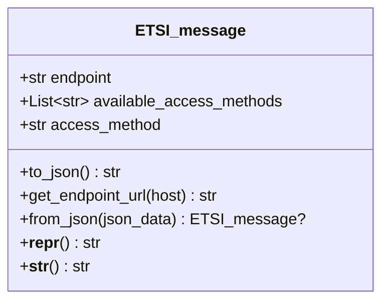
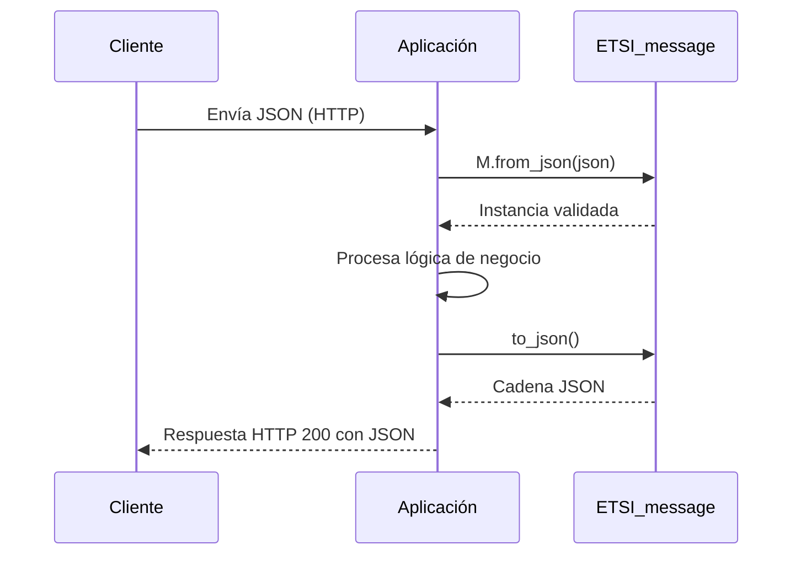

# 0. Título y resumen

**ETSI_message — Modelo base de mensajes ETSI (Pydantic v2)**

Este documento describe en detalle el diseño, uso y consideraciones técnicas del modelo `ETSI_message`, un **modelo base** para representar mensajes compatibles con interfaces ETSI (European Telecommunications Standards Institute) en aplicaciones Python. El modelo está construido sobre **Pydantic v2**, ofrece **serialización/parseo JSON** y una **validación declarativa** del método de acceso HTTP, sirviendo como cimiento para clases especializadas que extiendan su comportamiento (p. ej., cálculo de URLs completas de endpoint).

---

## Tabla de contenidos
- [1. Descripción general y casos de uso](#1-descripción-general-y-casos-de-uso)
- [2. Arquitectura interna y lógica](#2-arquitectura-interna-y-lógica)
- [3. Instalación y requisitos](#3-instalación-y-requisitos)
- [4. Modo de uso (CLI, librería, API, contenedor)](#4-modo-de-uso-cli-librería-api-contenedor)
- [5. Flujo de trabajo end-to-end](#5-flujo-de-trabajo-end-to-end)
- [6. Ejemplos prácticos](#6-ejemplos-prácticos)
- [7. Limitaciones, seguridad y rendimiento](#7-limitaciones-seguridad-y-rendimiento)
- [8. Roadmap y extensiones futuras](#8-roadmap-y-extensiones-futuras)
- [9. Licencia y créditos](#9-licencia-y-créditos)
- [Anexos](#anexos)

---

# 1. Descripción general y casos de uso

`ETSI_message` es una **clase base** (hereda de `pydantic.BaseModel`) orientada a modelar mensajes intercambiados a través de una *Network Interface* conforme a prácticas inspiradas en ETSI. Proporciona:

- **Campos básicos** de metadatos de transporte:
  - `endpoint` (`str`): ruta/URL asociada al mensaje (no se serializa por defecto).
  - `available_access_methods` (`List[str]`): métodos HTTP soportados (p. ej., `GET`, `POST`).
  - `access_method` (`str`): método HTTP en uso; se valida que pertenezca a `available_access_methods`.
- **Serialización JSON** vía `to_json()` y **parseo** desde `str` o `dict` con `from_json()`.
- **Ganchos de validación** (validator) para asegurar consistencia de `access_method`.

### Casos de uso típicos
- **Capa de transporte** de una API/SDK ETSI: normalización de metadatos HTTP de una petición/respuesta.
- **Base para mensajes específicos**: clases hijas que añaden carga útil (payload), encabezados u operaciones auxiliares.
- **Serialización/Deserialización** confiable en pipelines de integración (p. ej., al leer de colas o persistir snapshots de mensajes).

---

# 2. Arquitectura interna y lógica

## 2.1 Estructura de la clase

```python
class ETSI_message(BaseModel):
    endpoint: str = Field('', frozen=True, exclude=True)
    available_access_methods: List[str] = Field([], frozen=True, exclude=True)
    access_method: str = Field('', frozen=True, exclude=True)

    class Config:
        validate_assignment = True  # Valida tras cada actualización

    @field_validator('access_method')
    def is_access_method_available(cls, access_method: str, info: ValidationInfo) -> str:
        if access_method not in info.data['available_access_methods']:
            raise ValueError('Invalid access method')
        return access_method

    def to_json(self) -> str:
        return self.model_dump_json(exclude_none=True)

    def get_endpoint_url(self, host: str) -> str:
        return ''  # a ser sobreescrito por subclases

    @classmethod
    def from_json(cls, json_data: Union[str, Dict[str, Any]]) -> Optional["ETSI_message"]:
        if isinstance(json_data, str):
            return cls.model_validate_json(json_data)
        if isinstance(json_data, dict):
            return cls(**json_data)
        return None

    def __repr__(self) -> str:
        return self.model_dump_json(exclude_none=True, indent=2)

    def __str__(self) -> str:
        return self.model_dump_json(exclude_none=True, indent=2)
```

> **Nota:** Los campos están marcados con `frozen=True` (inmutables tras la creación) y `exclude=True` (se excluyen de la serialización por defecto). Véase [§7](#7-limitaciones-seguridad-y-rendimiento) para implicaciones.

### 2.2 Diagrama de clases (simplificado)



### 2.3 Validación
- **`field_validator('access_method')`**: garantiza que `access_method` ∈ `available_access_methods`. Si no, se lanza `ValueError`, que Pydantic normaliza en un `ValidationError` de modelo.
- **`validate_assignment=True`** (ver §7 para Pydantic v2): activa validación en asignaciones posteriores a la instancia. Sin embargo, al ser campos `frozen`, la asignación está prohibida.

### 2.4 Serialización y parseo JSON
- **`to_json()`** → `str`: serializa el modelo excluyendo `None` y los campos marcados `exclude=True`.
- **`from_json()`**: construcción desde `str` (JSON) o `dict`. Cualquier otro tipo retorna `None`.
- **`__repr__/__str__`**: representaciones legibles, con indentación.

### 2.5 Contratos de los métodos

| Método | Parámetros | Retorno | Excepciones | Efectos colaterales |
|---|---|---|---|---|
| `to_json()` | – | `str` JSON | – | No aplica |
| `get_endpoint_url(host)` | `host: str` | `str` | – | **Placeholder** (debe ser sobreescrito) |
| `from_json(json_data)` | `json_data: str | dict` | `ETSI_message | None` | `ValidationError` al parsear JSON inválido; `ValueError` desde validación (envuelto en `ValidationError`) | No aplica |

### 2.6 Complejidad
- Todas las operaciones son **O(n)** respecto al tamaño del JSON en serialización/parseo, dominado por operaciones de Pydantic.

---

# 3. Instalación y requisitos

## 3.1 Requisitos de sistema
- **Python**: ≥ 3.8 (recomendado 3.10+).
- **Dependencias**: `pydantic>=2.0`.

> Si el proyecto debe ser compatible con Pydantic v1, consulte la guía de migración en el [Anexo K](#k-migración-y-retrocompatibilidad).

## 3.2 Instalación

Con `pip`:
```bash
pip install pydantic>=2.0
```

Archivo `requirements.txt` mínimo:
```txt
pydantic>=2.0
```

## 3.3 Variables de entorno / puertos / servicios externos
**No se infiere del código proporcionado.**

---

# 4. Modo de uso (CLI, librería, API, contenedor)

## 4.1 Uso como librería (Python)

### Crear una instancia válida
```python
from etsi_message import ETSI_message  # o la ruta real del módulo

msg = ETSI_message(
    endpoint="/nbi/resource",
    available_access_methods=["GET", "POST"],
    access_method="GET",
)
print(msg.to_json())  # Campos excluidos no aparecerán en el JSON
```

### Parsear desde JSON (`str` o `dict`)
```python
# Desde cadena JSON
raw = '{"endpoint": "/nbi/resource", "available_access_methods": ["GET"], "access_method": "GET"}'
msg = ETSI_message.from_json(raw)

# Desde dict
payload = {
    "endpoint": "/nbi/resource",
    "available_access_methods": ["GET", "POST"],
    "access_method": "POST",
}
msg = ETSI_message.from_json(payload)
```

### Manejo de errores de validación
```python
from pydantic import ValidationError

try:
    ETSI_message(
        endpoint="/nbi/resource",
        available_access_methods=["GET"],
        access_method="POST",  # inválido
    )
except ValidationError as e:
    print("Error de validación:", e)
```

### Extender la clase (sobrescribir `get_endpoint_url`)
```python
from urllib.parse import urljoin

class MyETSIMessage(ETSI_message):
    def get_endpoint_url(self, host: str) -> str:
        # host p. ej.: "https://api.example.com/"
        return urljoin(host.rstrip('/') + '/', self.endpoint.lstrip('/'))

m = MyETSIMessage(
    endpoint="/nbi/resource",
    available_access_methods=["GET"],
    access_method="GET",
)
print(m.get_endpoint_url("https://api.example.com"))
```

## 4.2 CLI
**No se infiere del código proporcionado.**

## 4.3 API (REST/gRPC)
**No se infiere del código proporcionado.**

## 4.4 Contenedor (Docker)
**No se infiere del código proporcionado.**

---

# 5. Flujo de trabajo end-to-end



**Notas:**
- Si el JSON de entrada no respeta las reglas, `from_json()` terminará en `ValidationError`.
- `endpoint`/`available_access_methods`/`access_method` no se incluyen en la salida si `exclude=True` se mantiene por defecto.

---

# 6. Ejemplos prácticos

## 6.1 Serialización/Deserialización básica
```python
m1 = ETSI_message(
    endpoint="/capabilities",
    available_access_methods=["GET"],
    access_method="GET",
)
js = m1.to_json()
print(js)  # "{}" si todos los campos están excluidos de serialización
m2 = ETSI_message.from_json(js)
print(repr(m2))
```

## 6.2 Validación del método de acceso
```python
from pydantic import ValidationError

try:
    ETSI_message(
        endpoint="/ops",
        available_access_methods=["GET", "PUT"],
        access_method="DELETE",
    )
except ValidationError as e:
    # "Invalid access method"
    print(e)
```

## 6.3 Subclase con payload adicional
```python
from typing import Optional
from pydantic import Field

class ETSIGetResource(ETSI_message):
    resource_id: Optional[str] = Field(None, description="Identificador del recurso")

    def get_endpoint_url(self, host: str) -> str:
        base = host.rstrip('/') + '/' + self.endpoint.strip('/')
        return f"{base}/{self.resource_id}" if self.resource_id else base

m = ETSIGetResource(
    endpoint="/nbi/resource",
    available_access_methods=["GET"],
    access_method="GET",
    resource_id="abc-123",
)
print(m.get_endpoint_url("https://api.example.com"))
print(m.to_json())  # Por defecto, solo serializa campos no excluidos
```

---

# 7. Limitaciones, seguridad y rendimiento

## 7.1 Limitaciones funcionales
- `get_endpoint_url()` está **sin implementar** en la clase base; debe **sobrescribirse** en subclases.
- Los campos `endpoint`, `available_access_methods` y `access_method` están marcados con `exclude=True`, por lo que **no aparecerán en el JSON** generado por `to_json()` a menos que se cambie explícitamente el comportamiento en `model_dump_json(...)` o se elimine `exclude=True` en la definición del campo.
- La combinación de `frozen=True` con `validate_assignment=True` implica que **no se pueden actualizar** estos campos tras la construcción. La validación en asignación, por tanto, no tendrá efecto en dichos campos.

## 7.2 Consideraciones de Pydantic v2
- La configuración moderna en Pydantic v2 se recomienda vía `model_config = ConfigDict(validate_assignment=True)`. La clase `Config` se mantiene por compatibilidad parcial, pero **puede no surtir efecto** en todos los casos. Se sugiere migrar a `model_config` en el Roadmap (§8).
- En Pydantic v2, la API de parseo/serialización recomendada (`model_validate_json`, `model_dump_json`) ya está en uso.

## 7.3 Seguridad (authn/authz, secretos, mitigaciones)
- **Autenticación/Autorización:** **No se infiere del código proporcionado.**
- **Gestión de secretos/PII:** El modelo no maneja secretos ni datos sensibles per se; se recomienda **sanitizar** cargas útiles en subclases.
- **Validaciones:** El validator asegura coherencia del método HTTP, reduciendo errores de lógica. Para robustez, considere usar **Enums** o `Literal[...]` para `access_method`.

## 7.4 Rendimiento
- Serialización y parseo son lineales con el tamaño del JSON. El costo de validación es marginal.

---

# 8. Roadmap y extensiones futuras
- Migrar configuración a Pydantic v2 idiomático: `model_config = ConfigDict(validate_assignment=True)`.
- Cambiar `available_access_methods` a `Set[str]` o `Enum` (`Literal["GET", "POST", ...]`) para validación más estricta y evitar duplicados.
- Implementar `get_endpoint_url(host)` en la base con reglas genéricas y permitir override.
- Permitir **inclusión selectiva** de campos (quitar `exclude=True` o usar `model_dump(..., include=...)`).
- Añadir **payloads** y contratos formales (OpenAPI/JSON Schema) exportables.
- Integración con **logging** y **tracing** para auditoría de mensajes.

---

# 9. Licencia y créditos

**Licencia:** `RELLENAR`

**Créditos / Autoría:** **No se infiere del código proporcionado.**

---

# Anexos

## A. Árbol del repositorio

```text
.
└── ETSI_message.py
```

## B. Esquemas de datos / contratos API

Ejemplo de **esquema conceptual** (los campos marcados `exclude=True` no se exportan por defecto en JSON):

| Campo | Tipo | Requerido | Descripción |
|---|---|---|---|
| `endpoint` | `str` | No (por defecto `''`) | Ruta relativa o absoluta del recurso. *Excluido de JSON.* |
| `available_access_methods` | `List[str]` | No (por defecto `[]`) | Métodos HTTP soportados. *Excluido de JSON.* |
| `access_method` | `str` | No (por defecto `''`) | Método HTTP actual. Validado contra la lista anterior. *Excluido de JSON.* |

> Para subclases, añadir filas con los campos adicionales y su semántica.

## C. Diagramas adicionales (componentes, despliegue, secuencias)

### C.1 Diagrama de componentes (posición del modelo)
```mermaid
flowchart LR
  Client[Cliente/SDK] --> API[Controlador HTTP]
  API -->|JSON in/out| Model[ETSI_message (+ subclases)]
  Model --> Logic[Lógica de negocio]
  Logic --> Store[(Persistencia/Colas)]
```

## D. Tabla de dependencias

| Paquete | Versión sugerida | Motivo |
|---|---:|---|
| `pydantic` | `>=2.0` | Base de modelos con validación/serialización |

> No se detectan otras dependencias en el archivo proporcionado.

## E. Guía de pruebas y cobertura

### E.1 Dependencias de test
```txt
pytest
```

### E.2 Casos recomendados
- Construcción válida/Inválida de `ETSI_message`.
- Serialización y parseo (`to_json` / `from_json`).
- Subclase que implementa `get_endpoint_url`.

### E.3 Ejemplos de pruebas (`pytest`)
```python
import pytest
from pydantic import ValidationError
from etsi_message import ETSI_message

def test_valid_instance():
    m = ETSI_message(endpoint="/nbi/x", available_access_methods=["GET"], access_method="GET")
    assert isinstance(m, ETSI_message)

def test_invalid_access_method():
    with pytest.raises(ValidationError):
        ETSI_message(endpoint="/nbi/x", available_access_methods=["GET"], access_method="POST")

def test_json_roundtrip():
    m = ETSI_message(endpoint="/a", available_access_methods=["GET"], access_method="GET")
    js = m.to_json()
    m2 = ETSI_message.from_json(js)
    assert isinstance(m2, ETSI_message)

class _M(ETSI_message):
    def get_endpoint_url(self, host: str) -> str:
        return f"{host.rstrip('/')}/api{self.endpoint}"

def test_get_endpoint_url_subclass():
    m = _M(endpoint="/v1/r", available_access_methods=["GET"], access_method="GET")
    assert m.get_endpoint_url("https://ex") == "https://ex/api/v1/r"
```

## F. Observabilidad (logs, métricas, tracing)
- **Logs**: integrar en subclases y puntos de entrada (controladores HTTP). **No se infiere del código proporcionado.**
- **Métricas**: contabilizar parseos/validaciones exitosas y errores.
- **Tracing**: propagar `trace_id`/`span_id` en mensajes si aplica.

## G. Checklist de seguridad
- [ ] Validar `host` y `endpoint` para evitar *open redirects* o *path traversal*.
- [ ] Usar `Enum`/`Literal` para `access_method`.
- [ ] Sanitizar payloads de subclases.
- [ ] Evitar exponer secretos en serialización (`exclude=True` en campos sensibles).
- [ ] Revisar compatibilidad con Pydantic v2 (`model_config`).

## H. Troubleshooting
- **`ValidationError: Invalid access method`**: asegúrese de que `access_method` esté incluido en `available_access_methods`.
- **JSON de salida vacío (`{}`)**: todos los campos están excluidos de la serialización por defecto. Cambie `exclude=True` o use `model_dump(include={...})`.
- **`get_endpoint_url()` vacío**: implemente/sobrescriba en subclases.

## I. Benchmarking y rendimiento
- Use `timeit`/`pytest-benchmark` para medir `model_validate_json` y `model_dump_json` en payloads representativos.
- Pruebe con tamaños desde 1 KB hasta 1 MB de JSON para dimensionar throughput.

## J. Compatibilidad y portabilidad
- Probado con Python ≥ 3.8. Para entornos con Python antiguos, considere *backports* o entornos virtuales.
- Pin de dependencia recomendado para reproducibilidad: `pydantic~=2.8` (ajústese a su *toolchain*).

## K. Migración y retrocompatibilidad
- **De Pydantic v1 a v2**:
  - `parse_raw` → `model_validate_json`.
  - `json()` → `model_dump_json()`.
  - `@validator` → `@field_validator`.
  - `class Config` → `model_config = ConfigDict(...)` (recomendado).
- Revise cambios en exclusión/inclusión de campos y validaciones post-asignación.

---

**Fin del documento.**

